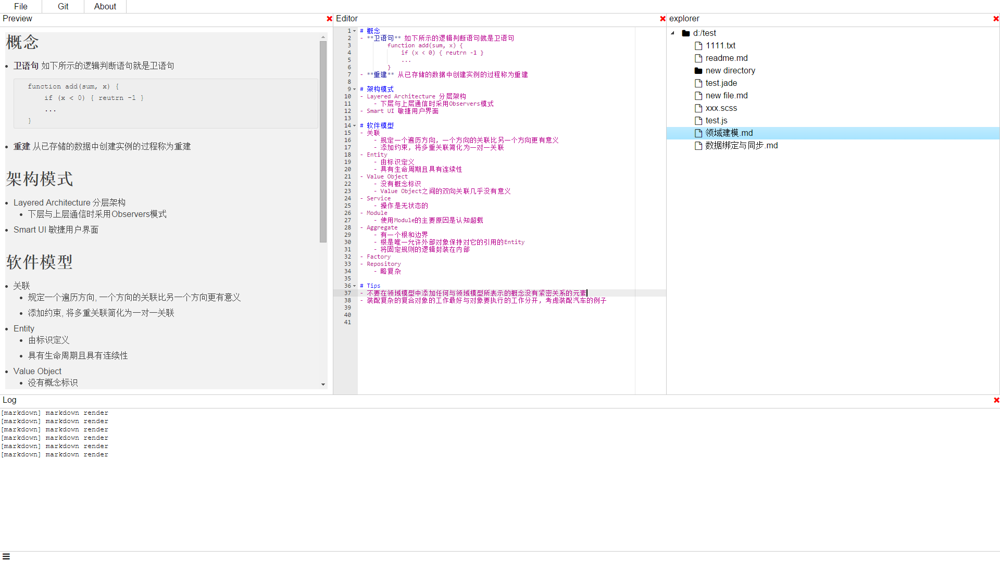

> This is under development, DO NOT USE IN YOUR WORK

Neve is a font end IDE used node-webkit, for now it is only a demo project, but will be a product in the any future.

# Preview

(ugly for now)

# Install
- checkout neve
- download node-webkit
- open /src/home/index.html in node-webkit
